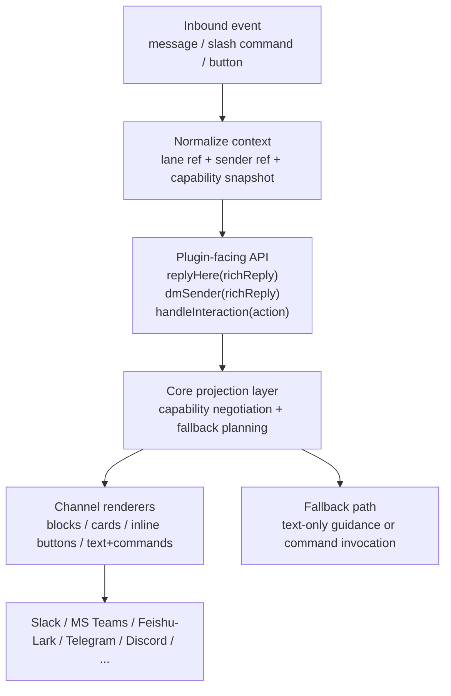
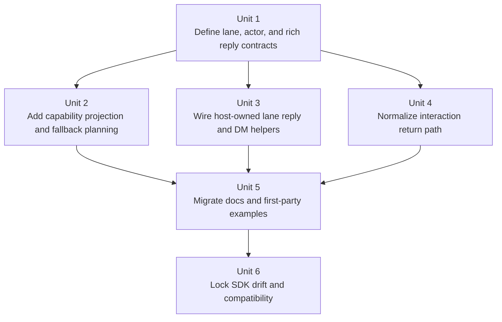

# feat: Add host-owned lane-oriented rich channel interface

## Overview

Add an additive, host-owned channel interface so plugin authors can express
conversation intent once and let OpenClaw own the vendor-specific transport and
UI projection:

- reply in the same lane that produced the inbound event
- send a DM to the sender on that same channel
- declare rich experiences once and let OpenClaw render buttons, blocks, cards,
  or selects when a channel supports them
- fall back to text-only guidance or command invocation when a rich surface is
  unavailable or disabled, without asking the plugin to author per-channel
  rescue paths
- keep Telegram Bot API, Discord Bot API, Slack Web API, Teams Graph details,
  and Feishu/Lark request shapes out of third-party plugin code entirely

The design should sit on top of the existing `DeliveryContext`,
`ChannelOutboundAdapter`, and channel plugin contracts rather than replacing the
transport layer. Rich rendering and vendor-specific fallbacks should be owned by
OpenClaw channel adapters, not by plugins such as
`openclaw-codex-app-server`.

Implementation note: completed on `codex/host-owned-channel-interface`. The
suggested file lists in this plan were directional; the shipped work used a few
adjacent seams where that produced a smaller, safer change while preserving the
host-owned lane, DM, and semantic interaction goals.

## Problem Frame

OpenClaw already has the beginnings of a generic conversation model:

- `src/utils/delivery-context.ts` records lane identity as
  `{ channel, to, accountId, threadId }`
- `src/infra/outbound/targets.ts` routes replies back to the current lane
- `src/channels/plugins/types.adapters.ts` defines a generic outbound adapter
  with `sendPayload`, `sendText`, `sendMedia`, and `sendPoll`
- `src/interactive/payload.ts` already defines normalized interactive reply
  blocks
- channels such as Slack, MS Teams, and Feishu/Lark already advertise richer
  UI capabilities in their OpenClaw channel plugins

The notes in
`https://github.com/pwrdrvr/openclaw-codex-app-server/issues/76`
clarify that the current direction is still not strong enough. A plugin boundary
that says "use OpenClaw when possible, but call Telegram directly for the rest"
is still a broken boundary.

Today, the public plugin surface still nudges authors toward channel-specific
thinking, and some plugin integrations still end up owning vendor transport
knowledge:

- `src/plugins/runtime/types-channel.ts` exposes channel-namespaced runtime
  helpers such as `discord`, `slack`, `signal`, and `line`
- `src/plugins/types.ts` models interactive handlers as channel-specific unions
  with different response APIs for Telegram, Discord, and Slack
- plugins that want to say "reply here", "DM the sender", or "offer these
  choices" still need to reason about channel ids, sender ids, per-channel
  helper shapes, or which channels have buttons vs cards vs selects
- fallback behavior can drift into plugin-owned controller code, which leaks
  token lookup, endpoint names, and raw request payloads across the host/plugin
  boundary

This creates two mismatches:

- the intended plugin boundary is "talk to OpenClaw", but the actual experience
  still leaks channel-specific transport concerns
- the intended UX is "rich when possible, graceful fallback otherwise", but the
  current surfaces are optimized around channel-specific buttons rather than a
  cross-channel intent model

The goal of this plan is therefore stronger than the original version:

- make the generic lane model the default plugin contract
- make the rich interaction contract host-owned, semantic-action-based, and
  capability-driven
- ensure third-party plugins never need direct vendor bot or webhook API logic
  for common messaging and interaction flows

## Requirements Trace

- R1. Plugins can reply to the exact inbound lane without using
  channel-specific runtime methods.
- R2. Plugins can request a DM to the current sender through a generic contract
  when the channel supports it.
- R3. Plugins can describe rich interaction intent through a normalized payload
  and capability model instead of channel-specific button, block, or card APIs.
- R4. OpenClaw can project that rich intent to native channel UI when available
  and degrade gracefully to text-only or command-driven flows when it is not.
- R4a. Plugins declare semantic actions and fallback affordances once, and
  OpenClaw decides whether those become native buttons/cards/selects or
  text-and-command guidance on each channel.
- R5. Third-party plugins do not need to know vendor endpoint names, token
  lookup rules, raw request payloads, or fallback precedence for Telegram,
  Discord, Slack, MS Teams, Feishu/Lark, or similar channels.
- R6. The new surface is additive and backwards compatible for bundled and
  third-party plugins.
- R7. The interface is designed around cross-channel viability, with Slack, MS
  Teams, Feishu/Lark, Telegram, and Discord as representative target channels.
- R8. Public SDK exports, docs, API baselines, and contract tests stay aligned
  with the new surface.

## Scope Boundaries

- Do not require identical native UX on every channel; capability-aware
  degradation is part of the design.
- Do not redesign the underlying `ChannelPlugin` transport model or replace
  `ChannelOutboundAdapter` with a completely new transport abstraction.
- Do not move vendor-specific HTTP or SDK logic into third-party plugin code or
  repo-local plugin controllers as a fallback strategy.
- Do not require plugins to choose a renderer family such as "Telegram buttons"
  or "Teams cards" as part of normal authoring; renderer choice is host-owned.
- Do not force every advanced channel-specific admin or moderation action into
  the new generic surface; those can remain channel-owned operations inside
  OpenClaw.
- Do not change end-user message semantics beyond making the plugin authoring
  surface more consistent and the fallback behavior more predictable.

## Context & Research

### Relevant Code and Patterns

- `src/utils/delivery-context.ts` is the current normalized route identity and
  should remain the source of truth for lane resolution.
- `src/infra/outbound/targets.ts` already protects same-lane reply routing
  across shared-session cases, especially for `dmScope=main`.
- `src/channels/plugins/types.adapters.ts` already has a generic outbound
  contract worth preserving and lifting into a better plugin-facing API.
- `src/interactive/payload.ts` already provides normalized `text`, `buttons`,
  and `select` blocks, which is a strong starting point for a richer
  channel-neutral interaction contract.
- `src/channels/plugins/types.core.ts` already carries static channel
  capabilities and message-tool discovery capabilities, which can become the
  basis for capability negotiation rather than channel-name branching.
- `src/plugins/types.ts` shows that plugin commands are already lane-oriented in
  spirit because they return `ReplyPayload` and core routes the reply on the
  active conversation.
- `src/plugins/interactive.ts` and `src/plugins/interactive.test.ts` show the
  existing channel-specific interaction dispatch layer that will need a
  compatibility wrapper rather than a flag-day rewrite.
- `src/plugin-sdk/conversation-runtime.ts`,
  `src/plugin-sdk/outbound-runtime.ts`, and
  `src/plugin-sdk/interactive-runtime.ts` are existing focused public subpaths
  and are a better evolution point than expanding the legacy
  `src/plugin-sdk/channel-runtime.ts` shim.
- `extensions/slack/src/shared.ts` already documents Slack-native interactive
  replies and text fallback guidance.
- `extensions/msteams/src/channel.ts` already advertises card capabilities and
  same-lane reply targeting hints.
- `extensions/feishu/src/channel.ts` already exposes rich delivery hints and
  channel-specific capabilities for cards, editing, threading, and reactions.
- `src/plugin-sdk/AGENTS.md` and `src/channels/AGENTS.md` both reinforce that
  new seams should flow through `openclaw/plugin-sdk/*` instead of direct
  `src/channels/**` exposure.

### Institutional Learnings

- No `docs/solutions/` knowledge base was present in this repo, so there were
  no institutional learnings to carry forward for this topic.

### External References

- External research was intentionally skipped. The repo already has strong
  local patterns for plugin runtime surfaces, channel contracts, and SDK export
  discipline, and the main open question is architectural fit within OpenClaw's
  existing boundaries rather than third-party framework behavior.
- The notes in `pwrdrvr/openclaw-codex-app-server#76` materially change the
  design constraint: the plugin/controller boundary must not leak Telegram Bot
  API, Discord Bot API, or similar vendor-specific transport details.

## Key Technical Decisions

- Add a host-owned rich interaction contract on top of `DeliveryContext`,
  `ReplyPayload`, and `ChannelOutboundAdapter` rather than replacing channel
  transports.
  Rationale: the transport layer is already generic enough; the real gap is a
  plugin-facing contract for lane routing, actor targeting, rich interaction
  intent, and fallback semantics.

- Keep vendor-specific transport logic entirely inside OpenClaw channel
  adapters.
  Rationale: issue `#76` makes this explicit. A third-party plugin should not
  need Telegram endpoint names, Discord route shapes, Slack block transport
  details, or token resolution rules. If raw vendor fallback exists, it belongs
  in OpenClaw's own channel implementations, not in plugin controller code.

- Evolve focused SDK subpaths such as `conversation-runtime`,
  `outbound-runtime`, and `interactive-runtime` instead of widening the legacy
  `channel-runtime` shim.
  Rationale: `src/plugin-sdk/AGENTS.md` prefers narrow, purpose-built subpaths
  and explicitly warns against broad convenience surfaces.

- Introduce a normalized lane/actor vocabulary plus a rich reply/fallback
  vocabulary in the public contract.
  Rationale: "reply here", "DM this sender", "offer these choices", and "fall
  back to this text or command" are intent-level operations. Plugins should not
  need to manually juggle `to`, `threadId`, callback ids, cards vs blocks vs
  inline buttons, or provider-specific route strings to express those intents.

- Represent rich interactions around semantic actions with host-owned fallback
  affordances.
  Rationale: the stable cross-channel unit is not "Telegram inline button" or
  "Teams Adaptive Card" but "user can choose action X". Labels, descriptions,
  confirmation text, and fallback commands can project into many renderer
  families while preserving one plugin-owned intent model.

- Model channel differences as capabilities and renderers, not as plugin-facing
  vendor APIs.
  Rationale: Slack, MS Teams, Feishu/Lark, Telegram, and Discord differ in what
  they can render, but plugin authors should only choose among normalized
  capabilities and fallback behavior, not channel-specific HTTP or SDK methods.

- Keep existing raw channel-specific runtime namespaces only as legacy
  compatibility surfaces, not as the recommended design center.
  Rationale: additive migration still matters, but docs and first-party example
  code should stop steering plugin authors toward channel namespaces for common
  flows.

- Migrate bundled plugins and docs to the new surface before considering any
  future tightening of legacy plugin-facing helpers.
  Rationale: OpenClaw should prove the new interface on its own rich channels
  before asking external plugins to adopt it.

## Open Questions

### Resolved During Planning

- Should this be additive or breaking?
  Resolution: additive only. Existing plugin shims stay working; the new
  interface becomes the preferred path.

- Should the generic model replace `DeliveryContext`?
  Resolution: no. `DeliveryContext` remains the canonical route identity; the
  new interface should wrap it with a better authoring model.

- Should third-party plugins ever own raw vendor API fallbacks?
  Resolution: no. If vendor-specific transport fallback is needed, it belongs
  inside OpenClaw channel adapters, not in plugin controller code.

- Should the new interface live in a broad catch-all SDK file?
  Resolution: no. Use focused `openclaw/plugin-sdk/*` subpaths and
  `api.runtime.channel` helpers instead of widening `channel-runtime`.

### Deferred to Implementation

- Exact type and export names for the normalized lane, actor, and rich reply
  objects.
  This is a naming decision that should follow the final call sites once the
  implementation touches the existing facades.

- Whether the rich reply contract should extend the existing
  `InteractiveReply` shape directly or introduce a new richer wrapper that
  embeds `InteractiveReply` plus fallback metadata.
  This depends on how much of the current `ReplyPayload` structure can be reused
  cleanly without overloading it.

- Whether the generic interaction API lands as a new registration method,
  a new helper that wraps `registerInteractiveHandler`, or both.
  The answer depends on which option yields the cleanest migration with the
  least duplication in dispatch wiring.

- Which rich primitives should be part of the cross-channel baseline for v1:
  text, buttons, select menus, cards, command invocations, or some subset.
  This should be finalized against the actual Slack, MS Teams, Feishu/Lark, and
  Telegram/Discord renderer constraints during implementation.

## High-Level Technical Design

> _This illustrates the intended approach and is directional guidance for review, not implementation specification. The implementing agent should treat it as context, not code to reproduce._

The key shape change is that plugin code should act on three normalized
concepts:

- **Lane ref**: the current conversation lane, derived from the ambient inbound
  context or an explicit conversation binding
- **Actor ref**: the sender or target actor within a channel, with an optional
  DM route when the channel can resolve one
- **Rich reply intent**: structured content plus explicit fallback behavior that
  OpenClaw can project to channel-native UI or plain text
- **Semantic action**: a stable plugin-defined action id plus presentation
  metadata that can arrive from a native interaction callback or a fallback
  command invocation

Those normalized concepts then flow through generic runtime helpers and
capability checks instead of channel-specific senders or plugin-owned vendor API
fallbacks.

## Implementation Units

- [x] **Unit 1: Define normalized lane, actor, and rich reply contracts**

**Goal:** Introduce the public vocabulary for "reply here", "DM this sender",
and "offer this rich experience with fallback" without exposing raw channel
implementation details.

**Requirements:** R1, R2, R3, R4, R5, R7

**Dependencies:** None

**Files:**

- Modify: `src/interactive/payload.ts`
- Modify: `src/plugins/types.ts`
- Modify: `src/plugins/runtime/types-channel.ts`
- Modify: `src/channels/plugins/types.adapters.ts`
- Modify: `src/channels/plugins/types.core.ts`
- Modify: `src/channels/plugins/types.plugin.ts`
- Modify: `src/plugin-sdk/channel-contract.ts`
- Modify: `src/plugin-sdk/conversation-runtime.ts`
- Modify: `src/plugin-sdk/interactive-runtime.ts`
- Test: `src/plugins/interactive.test.ts`
- Test: `src/channels/plugins/contracts/plugins-core.contract.test.ts`

**Approach:**

- Add normalized public types for lane refs, actor refs, rich reply intent, and
  channel capability snapshots to the plugin-facing contract.
- Add a semantic-action type that describes the action id, user-facing label,
  optional description, and fallback command/text affordance without committing
  to a specific renderer family.
- Define a channel-owned resolver seam for sender-DM routing so generic plugin
  code does not guess how to derive a DM target from provider-specific sender
  ids.
- Extend the current interactive payload model so it can carry fallback intent
  such as "render buttons if available, otherwise render this text and/or this
  command affordance".
- Keep the transport-facing adapter model intact; the new types should wrap
  existing route and reply primitives rather than replacing them.
- Extend `channel-contract`, `conversation-runtime`, and
  `interactive-runtime` with the narrowest set of public types/helpers needed
  for plugin authors and tests.

**Patterns to follow:**

- `src/utils/delivery-context.ts`
- `src/interactive/payload.ts`
- `src/channels/plugins/types.adapters.ts`
- `src/plugin-sdk/channel-contract.ts`
- `src/plugin-sdk/conversation-runtime.ts`

**Test scenarios:**

- Happy path: a normalized lane ref can represent a direct chat and a threaded
  group chat without losing `accountId` or `threadId`.
- Happy path: an actor ref can carry sender identity plus a channel-resolved DM
  target when the channel supports direct messaging.
- Happy path: a rich reply intent can describe structured choices plus a text or
  command fallback without encoding any Telegram-, Discord-, Slack-, or Teams-
  specific payload shape.
- Happy path: a semantic action can be represented once and later projected as
  a button, card action, select option, or fallback command without changing
  the plugin-authored action id.
- Edge case: channels that cannot derive a DM target report unsupported state
  explicitly instead of returning an invalid route.
- Edge case: a channel that lacks rich interaction support can still consume the
  fallback fields without losing the core message intent.
- Error path: malformed or incomplete route inputs are rejected at the
  normalization layer rather than propagating broken targets to delivery.
- Integration: existing channel plugin contracts still typecheck when they do
  not adopt the new normalized surfaces yet.

**Verification:**

- The new public types can be consumed from `openclaw/plugin-sdk/*` without
  reaching into `src/channels/**`.
- The contract can describe cross-channel rich/fallback intent without exposing
  vendor endpoint names, token concepts, or raw request payloads.

- [x] **Unit 2: Add capability projection and fallback planning**

**Goal:** Let OpenClaw project rich reply intent into channel-native UI when
available and into text or command-driven fallback when it is not.

**Requirements:** R3, R4, R5, R7

**Dependencies:** Unit 1

**Files:**

- Modify: `src/interactive/payload.ts`
- Modify: `src/channels/plugins/outbound/interactive.ts`
- Modify: `src/channels/plugins/types.core.ts`
- Modify: `src/channels/plugins/types.adapters.ts`
- Modify: `extensions/slack/src/blocks-render.ts`
- Modify: `extensions/msteams/src/channel.ts`
- Modify: `extensions/feishu/src/channel.ts`
- Modify: `extensions/telegram/src/button-types.ts`
- Modify: `extensions/discord/src/shared-interactive.ts`
- Test: `src/channels/plugins/outbound/interactive.test.ts`
- Test: `extensions/slack/src/blocks-render.test.ts`
- Test: `extensions/telegram/src/button-types.test.ts`

**Approach:**

- Add a host-owned projection layer that inspects channel capabilities and
  chooses the best renderer for a rich reply intent.
- Keep the renderer choice inside OpenClaw so plugins provide intent and
  fallback metadata, not vendor-specific block/card/button payloads.
- Expand the channel capability vocabulary so projection can distinguish between
  coarse transport support and richer affordances such as buttons, single
  select, cards, editable interactive messages, interaction acknowledgements,
  and fallback command support.
- Support a minimum fallback contract that can degrade to plain text guidance or
  a command-like invocation path when a channel lacks native rich UI.
- Treat Slack, MS Teams, and Feishu/Lark as proof points for richer renderers,
  while Telegram/Discord remain important compatibility and interaction-return
  channels.

**Patterns to follow:**

- `src/interactive/payload.ts`
- `src/channels/plugins/outbound/interactive.ts`
- `extensions/slack/src/blocks-render.ts`
- `extensions/msteams/src/channel.ts`
- `extensions/feishu/src/channel.ts`

**Test scenarios:**

- Happy path: the same rich reply intent renders as Slack blocks when Slack
  interactive replies are enabled.
- Happy path: the same rich reply intent renders as an MS Teams card when Teams
  advertises cards support.
- Happy path: the same rich reply intent renders as a Feishu/Lark card or other
  supported rich surface when that capability is available.
- Edge case: when a channel lacks rich rendering support, the projection layer
  chooses the declared text fallback rather than silently dropping interaction
  intent.
- Edge case: when only a subset of rich primitives is supported, unsupported
  blocks degrade cleanly without losing the core text content.
- Edge case: when a channel supports replies but not native interaction widgets,
  the projection layer emits the declared command/text fallback rather than
  pretending the action is unavailable.
- Error path: invalid or incomplete fallback metadata is rejected before it
  reaches a channel renderer.
- Integration: renderer selection depends on advertised channel capabilities,
  not channel-name branching in plugin code.

**Verification:**

- A plugin can describe one rich interaction and rely on OpenClaw to render it
  appropriately across Slack, MS Teams, Feishu/Lark, Telegram, and Discord
  paths.
- Rich replies can degrade to usable text or command flows without plugin-owned
  vendor logic.

- [x] **Unit 3: Wire host-owned lane reply and sender-DM helpers**

**Goal:** Make `api.runtime.channel` capable of delivering generic lane replies
and sender-targeted DMs through the existing outbound stack, with all vendor
transport logic remaining inside OpenClaw.

**Requirements:** R1, R2, R5, R6

**Dependencies:** Unit 1

**Files:**

- Modify: `src/plugins/runtime/runtime-channel.ts`
- Modify: `src/plugins/runtime/types-channel.ts`
- Modify: `src/utils/delivery-context.ts`
- Modify: `src/infra/outbound/targets.ts`
- Modify: `src/infra/outbound/deliver.ts`
- Modify: `src/plugin-sdk/outbound-runtime.ts`
- Modify: `src/plugin-sdk/conversation-runtime.ts`
- Test: `src/utils/delivery-context.test.ts`
- Test: `src/infra/outbound/message.channels.test.ts`
- Test: `src/infra/outbound/targets.test.ts`
- Test: `src/plugins/runtime.channel-pin.test.ts`

**Approach:**

- Add runtime helpers that accept a normalized lane ref or actor ref and route
  through the existing outbound adapter loader and target resolution path.
- Treat same-lane reply as the default operation, so plugin code does not need
  to rebuild `to`, `accountId`, or `threadId` from scratch.
- Resolve sender DMs through channel-owned target resolution logic instead of
  generic string manipulation or plugin-owned vendor API rules.
- Keep `DeliveryContext` as the canonical persisted route, with the new runtime
  helpers acting as thin, intention-revealing wrappers around it.

**Execution note:** Start with characterization coverage around current
same-lane routing and thread preservation before introducing the new helper
entry points.

**Patterns to follow:**

- `src/infra/outbound/targets.ts`
- `src/infra/outbound/deliver.ts`
- `src/plugins/runtime/runtime-channel.ts`
- `src/plugin-sdk/outbound-runtime.ts`

**Test scenarios:**

- Happy path: a plugin runtime helper replies to the exact inbound lane for a
  Telegram topic, a Slack thread, and a Discord channel without provider-
  specific branching.
- Happy path: a sender-DM helper resolves a DM target for a channel that
  supports direct messaging and delivers through the existing outbound adapter.
- Edge case: a same-lane reply in a shared `main` session still honors the
  original turn source and does not leak into another channel's `lastChannel`.
- Error path: a sender-DM request on a channel without DM support returns a
  structured unsupported result instead of a transport error.
- Integration: the runtime helper path still uses `loadChannelOutboundAdapter`
  and preserves existing outbound chunking, payload normalization, and delivery
  metadata.

**Verification:**

- Generic runtime helpers can deliver replies and DMs through the existing
  outbound stack without channel-specific runtime shims.
- A third-party plugin no longer needs any Telegram Bot API, Discord Bot API,
  or similar vendor transport fallback to cover common reply and DM flows.
- Existing route-safety guarantees around `turnSourceChannel` and persisted
  `deliveryContext` remain intact.

- [x] **Unit 4: Normalize the interaction return path**

**Goal:** Provide a channel-neutral inbound interaction context so native rich
surfaces and text/command fallbacks can converge on the same plugin-facing
semantic action model.

**Requirements:** R3, R4, R5, R7

**Dependencies:** Unit 1

**Files:**

- Modify: `src/plugins/types.ts`
- Modify: `src/plugins/interactive.ts`
- Modify: `src/plugins/commands.ts`
- Modify: `src/plugin-sdk/interactive-runtime.ts`
- Modify: `src/channels/plugins/types.core.ts`
- Modify: `src/channels/plugins/types.adapters.ts`
- Test: `src/plugins/interactive.test.ts`
- Test: `src/plugins/captured-registration.test.ts`

**Approach:**

- Add a normalized interaction context that exposes lane ref, actor ref,
  interaction payload, capability snapshot, and generic response helpers such as
  `reply`, `edit`, `clearInteractive`, and `acknowledge` where supported.
- Keep legacy per-channel handler registrations as compatibility wrappers that
  adapt into the new normalized context.
- Define a shared semantic action return path so native rich UI clicks and
  text/command fallback invocations can both deliver the same action payload to
  plugin code.
- Model channel-specific response differences as capabilities rather than as
  distinct context unions wherever possible.
- Keep any truly channel-only interaction features behind host-owned adapter
  seams rather than expanding the plugin-facing contract with new vendor APIs.

**Patterns to follow:**

- `src/plugins/interactive.ts`
- `src/plugins/types.ts`
- `src/plugin-sdk/interactive-runtime.ts`
- `src/interactive/payload.ts`

**Test scenarios:**

- Happy path: a normalized interaction handler can reply and edit buttons for a
  Telegram callback, a Discord button interaction, and a Slack button action
  through one shared response contract.
- Happy path: a text-only fallback command or invocation path can resolve to the
  same semantic action payload as the native rich button/select path.
- Happy path: the same semantic action id is observed by plugin code whether it
  originated from Slack, MS Teams, Feishu/Lark, Telegram, Discord, or a
  text-command fallback path.
- Happy path: capability metadata correctly advertises whether `acknowledge`,
  `edit`, `clearInteractive`, or follow-up responses are available.
- Edge case: a channel whose interaction model lacks one response action marks
  it unsupported without breaking other response methods.
- Error path: duplicate callback/interactions still dedupe correctly after the
  compatibility wrapper adapts into the normalized surface.
- Integration: legacy `registerInteractiveHandler` registrations continue to
  dispatch correctly through the adapter layer, and fallback command invocations
  can enter the same semantic action pipeline.

**Verification:**

- Bundled plugins can adopt a normalized interactive surface incrementally.
- The core dispatch layer still honors existing dedupe and conversation-binding
  behavior across both native rich interactions and fallback command paths.

- [x] **Unit 5: Migrate docs and first-party examples to the new default**

**Goal:** Make the host-owned lane and rich reply interface the documented and
demonstrated primary path for plugin development.

**Requirements:** R1, R2, R3, R4, R5, R7, R8

**Dependencies:** Units 2, 3, and 4

**Files:**

- Modify: `docs/plugins/sdk-runtime.md`
- Modify: `docs/plugins/sdk-overview.md`
- Modify: `docs/plugins/sdk-channel-plugins.md`
- Modify: `docs/plugins/architecture.md`
- Modify: `docs/plugins/sdk-migration.md`
- Modify: `src/plugin-sdk/channel-runtime.ts`
- Modify: `src/plugin-sdk/conversation-runtime.ts`
- Modify: `src/plugin-sdk/outbound-runtime.ts`
- Modify: `src/plugin-sdk/interactive-runtime.ts`
- Modify: `extensions/slack/src/channel.ts`
- Modify: `extensions/msteams/src/channel.ts`
- Modify: `extensions/feishu/src/channel.ts`
- Test: `test/channel-outbounds.ts`

**Approach:**

- Update docs to show `reply here`, `DM sender`, and normalized interaction
  handling as the preferred plugin path.
- Update docs and examples to show rich intent plus graceful fallback rather
  than channel-specific button helper usage.
- Update docs and examples to show semantic actions plus fallback guidance
  rather than channel-specific callback payload handling.
- Reframe `channel-runtime` as legacy compatibility only; do not add new
  examples there.
- Use Slack, MS Teams, and Feishu/Lark as first-class example channels for rich
  UI, and Telegram/Discord as important interaction-return and compatibility
  channels.
- Add migration guidance for external plugins that explicitly says vendor bot or
  webhook API fallback should not live in plugin code.

**Patterns to follow:**

- `docs/plugins/sdk-migration.md`
- `docs/plugins/sdk-overview.md`
- `src/plugin-sdk/AGENTS.md`

**Test scenarios:**

- Happy path: the documentation examples compile conceptually against the new
  public surface and no longer require channel-specific send helpers for common
  reply paths.
- Integration: representative rich channels can switch to the new helpers
  without changing the user-visible delivery behavior for supported rich flows.
- Edge case: channels without a given rich surface are documented as graceful
  fallback targets rather than as unsupported or plugin-owned transport escape
  hatches.
- Test expectation: none -- this unit is primarily documentation and targeted
  adoption, with behavior proven by the runtime and contract suites above.

**Verification:**

- The preferred docs path for new plugins uses the host-owned lane and rich
  reply interface.
- At least one real rich channel example demonstrates channel-native rendering
  and one fallback example demonstrates text/command degradation.

- [x] **Unit 6: Lock SDK drift, compatibility, and rollout safety**

**Goal:** Make the new interface durable by aligning exports, generated
baselines, and compatibility coverage with the new public contract.

**Requirements:** R6, R7, R8

**Dependencies:** Units 1 through 5

**Files:**

- Modify: `package.json`
- Modify: `scripts/lib/plugin-sdk-entrypoints.json`
- Modify: `src/plugin-sdk/entrypoints.ts`
- Modify: `src/plugin-sdk/api-baseline.ts`
- Modify: `docs/.generated/plugin-sdk-api-baseline.json`
- Modify: `docs/.generated/plugin-sdk-api-baseline.jsonl`
- Test: `src/channels/plugins/contracts/plugins-core.contract.test.ts`
- Test: `src/plugins/interactive.test.ts`
- Test: `src/utils/delivery-context.test.ts`

**Approach:**

- Publish any new or widened public SDK subpaths through the normal plugin-sdk
  export pipeline and baseline checks.
- Add compatibility-focused tests that prove existing channel-specific helpers
  still load while the new lane-oriented contract remains available.
- Add compatibility-focused tests that prove rich/fallback projection remains
  host-owned and does not require plugin-facing vendor APIs.
- Treat API drift as a first-class part of the change, not a postscript.
- Capture any deprecation notices or migration breadcrumbs in the docs and API
  contract instead of relying on tribal knowledge.

**Patterns to follow:**

- `src/plugin-sdk/AGENTS.md`
- `src/plugin-sdk/api-baseline.ts`
- `scripts/lib/plugin-sdk-entrypoints.json`
- `package.json`

**Test scenarios:**

- Happy path: newly exported SDK entrypoints appear in package exports, entrypoint
  metadata, and generated API baselines together.
- Edge case: older plugins that still depend on channel-specific runtime helpers
  continue to resolve those imports after the new interface lands.
- Edge case: new plugin-facing docs and type surfaces do not require Telegram,
  Discord, Slack, Teams, or Feishu/Lark vendor transport details to remain
  usable.
- Error path: export drift or missing baseline updates fail the contract checks
  instead of slipping into release artifacts.
- Integration: the public SDK docs, entrypoint metadata, and emitted package
  exports all describe the same surface.

**Verification:**

- The new public interface is represented consistently across source, generated
  artifacts, and docs.
- Compatibility checks make it hard to accidentally ship a partial migration.

## System-Wide Impact

- **Interaction graph:** This work touches the plugin runtime (`api.runtime`),
  plugin registration types, channel plugin contracts, outbound delivery,
  interactive dispatch, SDK exports, rich UI renderers, fallback projection,
  and plugin docs. It sits directly on the plugin/core boundary.
- **Error propagation:** Unsupported operations such as sender-DM on a
  non-DM-capable channel or a rich UI primitive on a text-only channel should
  return structured unsupported or fallback behavior at the normalized
  interface boundary rather than leaking low-level transport errors.
- **State lifecycle risks:** Route identity must continue to respect
  `DeliveryContext`, `turnSourceChannel`, and session-thread metadata so the new
  abstraction does not reintroduce cross-lane reply races.
- **API surface parity:** The lane-oriented surface should work across commands,
  tools, background plugin services, and interactive handlers. It should also
  support both rich-native and text-fallback paths. If a concept only works in
  one plugin entry point or one channel class, the abstraction is incomplete.
- **Integration coverage:** Cross-layer coverage is essential for same-lane
  reply routing, sender-DM resolution, capability projection, interactive
  dedupe, fallback command routing, and SDK export alignment.
- **Unchanged invariants:** `ChannelOutboundAdapter` and `DeliveryContext`
  remain valid. This plan changes the preferred plugin authoring surface and
  strengthens the host/plugin boundary; it does not move vendor transport logic
  out of OpenClaw channel implementations.

## Risks & Dependencies

| Risk                                                                                               | Mitigation                                                                                                                                                                                        |
| -------------------------------------------------------------------------------------------------- | ------------------------------------------------------------------------------------------------------------------------------------------------------------------------------------------------- |
| The new surface becomes another thin wrapper that still leaks channel-specific concepts everywhere | Keep lane ref, actor ref, rich reply intent, and capability vocabulary small and intention-focused; do not expose provider-specific route syntax or raw vendor payloads as the primary call shape |
| DM resolution semantics differ too much across channels                                            | Make sender-DM resolution channel-owned and capability-driven; return unsupported explicitly where a safe generic mapping does not exist                                                          |
| Rich UI surfaces differ too much across Slack, Teams, Feishu/Lark, Telegram, and Discord           | Normalize intent plus fallback, not a fake identical widget model; keep channel-specific rendering inside OpenClaw                                                                                |
| Plugins reintroduce vendor fallback logic because the new host surface is incomplete               | Make fallback projection a first-class host feature and document that vendor API logic does not belong in plugin code                                                                             |
| Public SDK drift lands incompletely across exports, docs, and baselines                            | Treat export metadata, docs, and baseline updates as a dedicated implementation unit with contract coverage                                                                                       |
| Bundled or third-party plugins break during migration                                              | Keep the change additive, preserve legacy registrations/helpers, and migrate first-party examples before considering any future deprecation                                                       |

## Documentation / Operational Notes

- Update the plugin SDK docs so new plugin authors see the host-owned
  lane-oriented rich reply path first and legacy channel helpers second.
- Add migration guidance that explicitly explains that vendor bot/webhook API
  fallback does not belong in plugin code.
- Document the expected graceful degradation model for channels with partial or
  no rich-interaction support.
- Treat this as a public SDK change: package exports, generated API baseline,
  and release-note communication must remain aligned.

## Sources & References

- Related issue: [pwrdrvr/openclaw-codex-app-server#76](https://github.com/pwrdrvr/openclaw-codex-app-server/issues/76)
- Related code: `src/utils/delivery-context.ts`
- Related code: `src/infra/outbound/targets.ts`
- Related code: `src/channels/plugins/types.adapters.ts`
- Related code: `src/interactive/payload.ts`
- Related code: `src/plugins/runtime/types-channel.ts`
- Related code: `src/plugins/types.ts`
- Related code: `src/plugins/interactive.ts`
- Related code: `src/plugin-sdk/conversation-runtime.ts`
- Related code: `src/plugin-sdk/outbound-runtime.ts`
- Related code: `src/plugin-sdk/interactive-runtime.ts`
- Related code: `extensions/slack/src/shared.ts`
- Related code: `extensions/msteams/src/channel.ts`
- Related code: `extensions/feishu/src/channel.ts`
- Related docs: `docs/plugins/sdk-runtime.md`
- Related docs: `docs/plugins/sdk-channel-plugins.md`
- Related docs: `docs/plugins/sdk-overview.md`
- Related docs: `docs/plugins/architecture.md`
- Related docs: `docs/plugins/sdk-migration.md`
